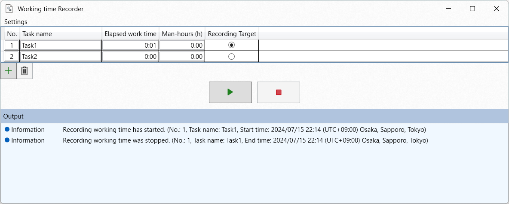

# Working-time-recorder
This tool is a tool to record work effort.
It is created with the assumption that it would be used to record work at an individual level.

# Environment
This tool has been confirmed to work on Windows 11.
If .NET8 is installed, it should work on Windows10 as well. 

# Development

| Item category | Item |
| --- | --- |
| Runtime | .NET8 |
| IDE | Visual Studio 2022 |
| Language | C# |
|||

#### Author's note
This tool has not been refactored enough.